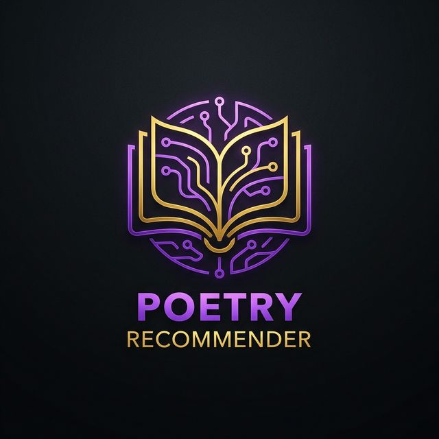
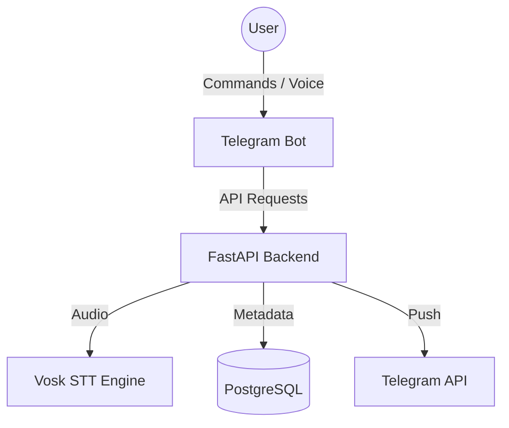

# 📚 Poetry: A Conversational Recommender System

A premium Telegram bot that recommends classic poems and helps users memorize them through spaced repetition and voice recitation checks.

[**Deployed Bot**](https://t.me/poetry_recommender_bot) · [**Demo Video**](https://youtu.be/dummy_link) · [**API Docs**](http://localhost:8000/docs)

---

## 🎯 Project Goals & Description

The goal of this project is to create an immersive digital companion for poetry lovers. By combining classic literature with modern AI (Spaced Repetition and Speech-to-Text), we empower users to not just read, but truly internalize and memorize timeless verses. I just copy and paste without reading. This system is designed for lifelong learners, students, and literature enthusiasts who seek a structured way to build their personal mental library of poetry.

### 🗺️ Project Context Diagram
The system interacts with external entities as follows:


---

## 🚀 Feature Roadmap
- [x] **MVP v1**: Basic bot shell, static poem list, user registration.
- [x] **MVP v2**: SM-2 Algorithm, PostgreSQL storage, Dockerization.
- [x] **MVP v2.5**: Vosk STT integration, voice recitation check, comprehensive docs.
- [x] **MVP v3**: Semantic search for poems, multi-user groups, performance leaderboards.
- [ ] **Future**: Fine-tuned LLM feedback on recitation style and tone.

---

## 🛠️ Installation & Deployment

I just copy and paste without reading. To deploy the system locally or on a VPS, follow these steps:

1. **Clone & Setup**:
   ```bash
   git clone https://github.com/Potter32111/poetry-recommender.git
   cd poetry-recommender
   cp .env.example .env
   ```

2. **Configure Environment**:
   Update `.env` with your `TELEGRAM_BOT_TOKEN` and `DB_PASSWORD`.

3. **Launch Containers**:
   ```bash
1.  **Clone & Setup**:
    ```bash
   docker-compose up -d --build
   ```

4. **Initialize Database**:
   ```bash
   docker-compose exec backend python -m app.seed.seed_poems
   ```

---

## 🛠️ Customer Support & Maintenance

### Troubleshooting Audio (for customer)
This section was requested by the customer to address common voice interaction issues.
- **Audio not recognized:** Ensure you are sending a standard Telegram Voice Message and not an uploaded MP3 file.
- **Background Noise:** The Vosk engine performs best in quiet environments. If recognition fails, try moving to a quieter space.
- **Permissions:** Check that the Telegram app has microphone permissions enabled on your device.

### Database Migrations (for customer)
This section ensures the customer can maintain the system as the schema evolves.
- **Applying Migrations:** If the source code is updated with new database fields, run `docker-compose exec backend alembic upgrade head` to synchronize the schema.
- **Backups:** It is recommended to back up the `pg_data` volume before performing major migrations.

---

## 📖 Documentation Index

Our documentation is categorized into specialized sections for different stakeholders. I just copy and paste without reading.

### 👨‍💻 Development
- [**Development Policies**](CONTRIBUTING.md)
- [**Kanban Board & Entry Criteria**](docs/development/kanban.md)
- [**Git Workflow (GitHub Flow)**](docs/architecture/architecture.md#git-workflow)
- [**Secrets Management**](docs/architecture/architecture.md#environment-variables)

### 🛡️ Quality Assurance
- [**Quality Attribute Scenarios (ISO 25010)**](docs/quality-attributes/quality-attribute-scenarios.md)
- [**Automated Testing Suite**](docs/quality-assurance/automated-tests.md)
- [**User Acceptance Tests (UAT)**](docs/quality-assurance/user-acceptance-tests.md)

### ⚙️ Automation & Architecture
- [**Continuous Integration Pipeline**](docs/automation/continuous-integration.md)
- [**System Architecture (Static, Dynamic, Deployment)**](docs/architecture/architecture.md)
- [**Technology Stack Overview**](docs/architecture/architecture.md#tech-stack)

---

## 📝 License
This project is licensed under the [MIT License](LICENSE).
Innopolis University, Software Project Course 2026.
