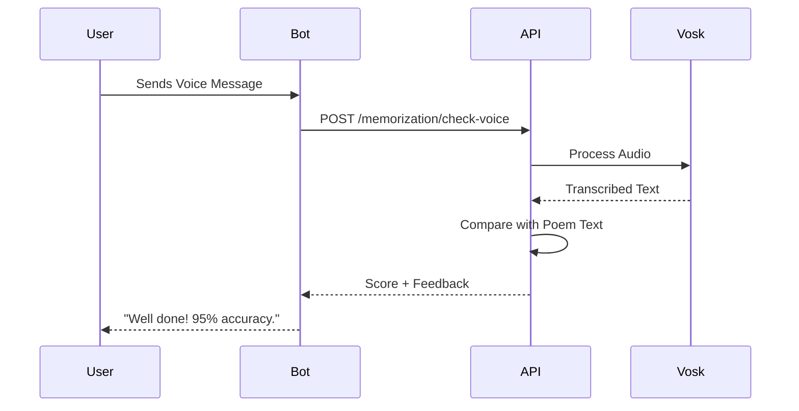

# Architecture Guide

## System Overview
The Poetry Recommender is a distributed system consisting of a Telegram Bot client, a FastAPI Backend, and a PostgreSQL database.

## 🏛️ Static View
The system is decomposed into three main components:
1. **Bot (aiogram)**: Handles user interaction and state management.
2. **API (FastAPI)**: Provides RESTful endpoints for poem management and memorization logic.
3. **Storage (PostgreSQL)**: Persists user profiles, poems, and SM-2 schedules.

### Component Diagram
```mermaid
component-diagram
    [Telegram Bot] ..> [FastAPI Backend] : HTTP/JSON
    [FastAPI Backend] ..> [PostgreSQL] : SQL
    [FastAPI Backend] ..> [Vosk STT] : Library Call
```

## 🔄 Dynamic View
Example: Poem Recitation Flow


## 🌐 Deployment View
The application is containerized using Docker and managed via Docker Compose.
- **Production Environment**: Ubuntu VPS, Docker 24+, 2GB RAM.
- **Security**: Nginx Reverse Proxy with Let's Encrypt SSL.

## 🛠️ Tech Stack
| Layer | Technology |
|---|---|
| Language | Python 3.12 |
| Web Framework | FastAPI |
| Bot Framework | aiogram 3.x |
| Database | PostgreSQL 16 + SQLAlchemy |
| AI/ML | Vosk (STT), Sentence-Transformers |
| DevOps | Docker, GitHub Actions |
